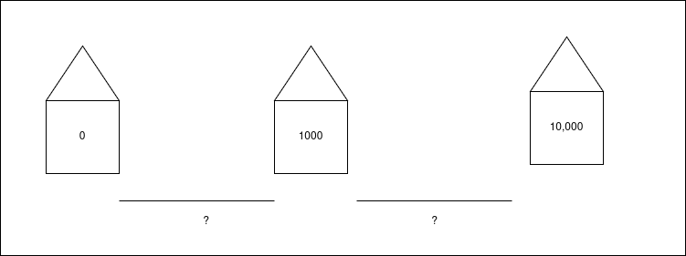
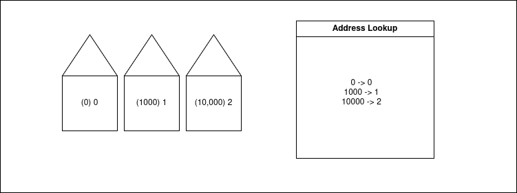

# Robin Hood Hashmaps
In this tutorial we'll look at implementing our own Robin Hood Hashmap in Ada. Hashmaps are useful in game systems because they strike a balance between usability and performance, and Robin Hood Hashmaps are one of the more performant variations. Let's briefly look at the theory, after that we'll get stuck in and code this thing.

## Hashmaps
Imagine you have an array of objects. One of the benefits is that accessing an element is constant lookup time (algorithmicly speeking). In other words, if you're on a street and you know which house number to visit, you can go there directly. The problem which hashmaps attempt to solve is: What if rather then house numbers we have other data structures? Or what if we have house numbers but they're sparse, maybe hundreds or thousands apart? Is there a way to store this sensibly in an array?



The solution is a little like this: Use some formula which can take in data and translate it to number, then constrain that number to a range and store that in an array. To use the house analogy this is like building all the houses close together, re-labling their numbers, and writing a second address book to tell outsiders how to find the original address they're after.



The trick with Hashmaps is to automate this address lookup system while keeping it performant.

## Hash Collisions
Commonly the hash function will allocate an object to a space on the array which is already filled. In this occurance there are two approaches: either let each box of the array hold a linked list of elements, or find another nearby empty box on the array. Since we're trying to make a performant data structure, dynamic lookups will be avoided and we'll go with the second approach. The process of looking for an empty box is called "probing", We can define "probe sequence length" to be the number of steps an entry is away from its ideal position.

## Robin Hood Hashing
Robin Hood Hashing is a heuristic which minimizes the maximum probe sequence length. When the algorithm encounters a full slot, it must decide whether to keep searching with its current entry, or to put the entry in the full slot, orphan the previous ownder, and then keep searching with the newly orphaned entry. In the robin hood scheme, all entries store their probe sequence lengths, this is the info used by the algorithm to decide: if the current entry has a larger probe sequence length than the housed entry, then the housed entry is "richer" and can afford to downsize to a cheaper neighbourhood (so to speak).

## Implementation
Before we get to the data structure, we'll need to define a new data type.

<data_types/primitives.ads>
```
package Primitives is
   type Uint32 is mod 2**32;
end Primitives;
```

Ada has modular types, these are unsigned integers with the sort of modular arithmetic you'd expect. In our situation I'm using them because bitwise operations are only defined on modular types. I'll be using bitwise and in order to compress the hash value.

Now onto the specification:

<data_structures/hashmaps.ads>
```
with Primitives; use Primitives;
generic
   type T is private;
   with function Key (Item : T) return Uint32;
package HashMaps is

   type Element is
      record
         Probe_Length : Uint32 := 0;
         Data : T;
         Free : Boolean := True;
      end record;

   type Elements_Type is array (Uint32 range <>) of Element;
   type Elements_Access is access Elements_Type;

   type HashMap is
      record
         Elements : Elements_Access := new Elements_Type (0 .. 1);
         Size : Uint32 := 0;
         Capacity : Uint32 := 1;
      end record;

   type HashMap_Access is access HashMap;

   procedure Insert (Target : HashMap_Access; Data : T);

   function Has (Target : HashMap_Access; Element_Key : Uint32) return Boolean;

   function Get (Target : HashMap_Access; Element_Key : Uint32) return T;

   procedure Remove (Target : HashMap_Access; Element_Key : Uint32);

   procedure Print (Target : HashMap_Access);

end HashMaps;
```

This should be pretty similar to the array implementation, with the addition of some metadata for the Array Elements.